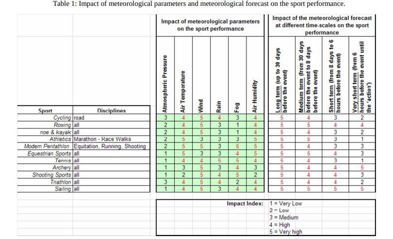

# Parâmetros de Modalidades 

De acordo com o autor Alessandro Pezzoli em sua publicação "Climatological Analysis, Weather Forecast and Sport Performance: Which are the Connections?", a maioria das modalidades esportivas ao ar livre, e em particular esportes de resistência, são fortemente influenciadas pela variação dos parâmetros meteorológicos. Entre as variáveis meteorológicas que influenciam fortemente as modalidades esportivas,tem-se: temperatura, vento, precipitação, neblina, pressão atmosférica e umidade relativa.

Ainda conforme Alessandro Pezzoli no artigo "Effect of the Environment on the Sport Performance", ele define que entre as variáveis mencionadas acima, as que mais impactam nas modalidades são: **vento**, **temperatura** e **umidade relativa**. 

 

 

Dessa forma, segue abaixo uma tabela com alguns exemplos de modalidades e seus respectivos parâmetros. Conforme a variação das condições metereológicas de uma determinada localidade, algumas atividades esportivas podem se tornar farováveis a serem praticadas, ou não.

O padrão de condições adotado segue a seguinte escala: 

* Condições favoráveis;

* Condições razoáveis;

* Condições ruins;

* Perigoso;

* Não adequado.

## Ventos

| Condições de vento | Windsurf | Kitesurf | Surf e Bodyboard | Stand Up Paddle | Vela |
| - | - | - | - | - | - |
0 a 20 nós | Condições favoráveis  | Condições favoráveis  | Condições favoráveis | Condições ruins | Não adequado |
21 a 30 nós | Não adequado  | Condições ruins | Condições ruins | Condições razoáveis | Perigoso |
31 a 40 nós | Condições razoáveis | Perigoso | Não adequado | Condições faroráveis | Condições ruins |
41 a 50 nós | Condições ruins | Condições razoáveis | Não adequado | Perigoso | Condições favoráveis |

 

## Temperatura

| Temperatura média | Windsurf | Kitesurf | Surf e Bodyboard | Stand Up Paddle | Vela |
| - | - | - | - | - | - |
15 a 19 ºC | Condições ruins | Condições razoáveis | Condições razoáveis | Não adequado | Condições favoráveis |
20 a 24 ºC | Condições favoráveis | Condições ruins | Condições razoáveis | Condições favoráveis | Condições razoáveis |
25 a 29 ºC | Condições ruins | Perigoso | Condições favoráveis | Não adequado | Condições razoáveis |
30 a 35 ºC | Condições razoáveis | Condições razoáveis | Perigoso | Condições ruins | Condições favoráveis |

## Umidade

<table>
  <tr>
    <th>Umidade relativa</th>
    <th>Windsurf</th>
    <th>Kitesurf</th>
    <th>Surf e Bodyboard</th>
    <th>Stand Up Paddle</th>
    <th>Vela</th>
  </tr>
  <tr>
    <td>Entre 70% e 40%</td>
    <td align="center" colspan="5">Condição favorável</td>
  </tr>
  <tr>
    <td>Entre 39% e 21%</td>
    <td align="center" colspan="5">Condição razoável</td>
  </tr>
  <tr>
    <td>Entre 20% e 13%</td>
    <td align="center" colspan="5">Condição ruim</td>
 
  </tr>
  <tr>
    <td>Abaixo de 12%</td>
    <td align="center" colspan="5">Perigoso</td>
  </tr>
</table>

 

# Referências Bibliográficas 

- VERMEERSCH, Wenzel; ALCOFORADO, Maria João; Wind as a resource for summer nautical recreation. Guincho beach study case; Disponível em: <http://www.scielo.mec.pt/scielo.php?script=sci_arttext&pid=S0430-50272013000100007>; Acesso em 19 de abril de 2019.
- PEZZOLI, Alessandro; CRISTOFORI, Elena; MONCALERO, Mateo; GIACOMETTO, Fiorella; Climatological Analysis, Weather Forecast and Sport Performance: Which are the Connections?; Disponível em: <https://www.researchgate.net/publication/256858745_Climatological_Analysis_Weather_Forecast_and_Sport_Performance_Which_are_the_Connections>; Acesso em 19 de abril de 2019.
- PEZZOLI, Alessandro; CRISTOFORI, Elena; MONCALERO, Mateo; GIACOMETTO, Fiorella; Effect of the Environment on the Sport Performance; Disponível em: <https://www.academia.edu/18927564/Effect_of_the_environment_on_the_sport_performance>
; Acesso em 23 de abril de 2019.