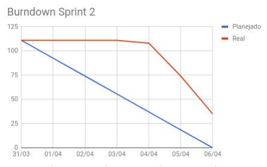
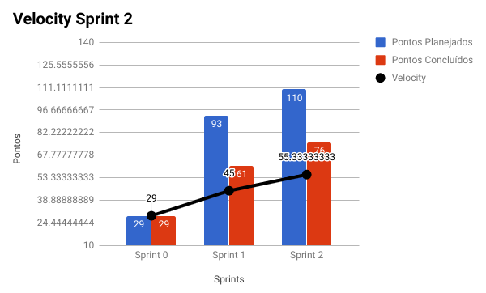

# RESULTADOS da Sprint 2

O objetivo da Sprint 2 foi orientar o time de MDS na construção da primeira História de Usuário que eles criaram. Foi decisão de EPS que o time de MDS construísse um chatbot qualquer para treinar, visando iniciar o código em Rasa na próxima Sprint. EPS deve continuar configurando ambiente e integração contínua, criar os documentos de análise e monitoramento do projeto. 

### Presentes na reunião 06/04/19

| Nome | Status |
| --------- | -------- |
| Amanda | não |
| Calebe | sim |
| Eduardo | sim |
| Indiara | sim |
| Luciana | sim |
| Luís | sim |
| Micaella | sim |
| Samuel | sim |
| Sofia | sim |

## Review

### Issues entregues

| Issues | Pontos |
| --------- | -------- |
| Criar identidade visual da Gaia | 3 |
| Criar protótipo de baixa fidelidade do chatbot | 5 |
| US01: Eu como usuário desejo que o sistema obtenha o clima de uma cidade para que eu possa saber as condições climáticas do dia | 8 |
| Criar plano de métricas | 5 |
| Criar canvas | 5 |
| Criar README | 1 |
| Evoluir EAP | 1 |
| Analisar custos do projeto | 5 |
| Criar pipeline de implementação | 3 |
| Criar plano de metodologia | 3 |
| Adicionar critérios de aceitação das issues | 3 |
| Configurar integração contínua do repositório Clima | 8 |
| Configurar integração contínua do repositório Local | 8 |
| Elicitar requisitos | 13 |
| Documentar resultados da Sprint 1 | 1 |
| Documentar planejamento da Sprint 2 | 1 |
| Configurar a folha de estilo nodeJS | 3 |

### Issues não entregues 

| Issues | Pontos |
| --------- | -------- |
| Construir um chatbot individual para estudo  | 5 |
| US02: Eu como usuário desejo que o sistema obtenha a latitute e a logitude de qualquer lugar do mundo a partir da API do Google Maps | 13 |
| Entregar pipeline DevOps | 3 |
| Entregar docker do Rasa | 13 |

### Total de pontos planejados: 110

### Pontos entregues: 76

### Pontos de dívidas para a próxima sprint: 34

## Burndown

## Velocity

## Retrospectiva: Aprendizados obtidos na *Sprint 2* 

## Quadro de Conhecimento 

## Health Check 

Na Sprint 2 houve a primeira coleta do Health Check, por isso ainda não é possível ver no gráfico a comparação entre as spints.

| - | Pontuação |
| --------- | -------- |
| Trabalho em Equipe  | 2 |
| Velocidade  | 1 |
| Respeito  | 1 |
| Propósito  | 1 |
| Aprendizado  | 1 |
| Diversão  | 2 |
| Empoderamento  | 1 |
| Facilidade de Equipe  | 2 |
| Saúde do Código  | 2 |

**Legenda:** 

1: Bom | 2: Mediano | 3: Ruim

### Observações levantadas ao longo da reunião

- Tratamento de dados, como tradução para português, unidades de medida e etc.
- Gerar cobertura de testes

## Avaliação Tech Lead

Na sprint 2 várias decisões foram tomadas. Foi a primeira Sprint em que MDS codou, porém algumas coisas precisavam ser feitas ainda, como o documento de identidade visual e o protótipo, avaliando que na próxima Sprint (Sprint 3) eles iniciariam o desenvolvimento em Rasa. Sendo assim, a sprint ficou extremamente grande e sobrecarregada por parte de MDS, porém EPS achou necessário. Assim como MDS, o time de EPS também ficou sobrecarregado, principalmente o DevOps, que pela segunda sprint seguida, deixou dívida técnica. 

Analisando burndown é possível ver que as entregas só passaram a acontecer a dois dias do fim da Sprint, tanto por parte de EPS como MDS, avaliando essa falta de entregas contínuas, foi passado para o time todo a importância das entregas constantes e como isso afeta a produtividade. Um acordo foi feito para que as entregas acontecessem mais constantemente.

Na sprint passada 83% das issues foram fechadas e nessa sprint 90% foram fechadas, isso mostra um crescimento na produtividade, porém a quantidade de pontos também cresceu. É importante ficar atento para que o planejamento seja condizente com as entregas.

O quadro de conhecimento mostra um certo conhecimento a respeito das principais tecnologias utilizadas no projeto, isso é interessante por mostrar que os treinamentos e medidas tomadas por EPS para que o time de MDS aprendesse foram eficazes. Porém na criação do bot individual tiveram bastante dificuldades, grande parte não conseguiu e os que conseguiram, não conseguiram treinar o bot, isso fez EPS se perguntar se o quadro de conhecimento reflete realmente a realidade. E a respeito do NodeJS, tiveram dificuldade mas quando entederam como fazia,foram bem sucedidos.

